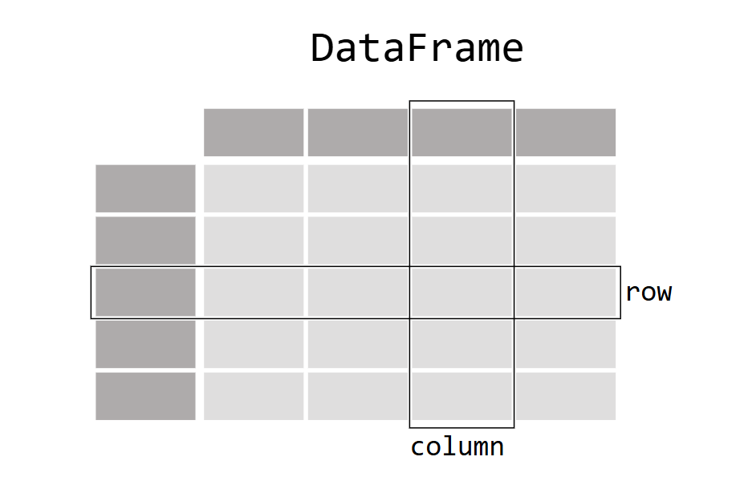

# Introduction à Pandas

## Qu'est-ce que Pandas ?
Pandas est une bibliothèque Python puissante pour l’analyse et la manipulation des données. Elle est particulièrement utile pour travailler avec des tableaux de données structurées comme dans **Excel** ou **SQL**.

#### Pourquoi utiliser Pandas ?
- Manipulation facile des tableaux de données.
- Chargement rapide de fichiers CSV, Excel, SQL.
- Fonctions intégrées pour l'analyse statistique et la visualisation.
- Large compatibilité avec les autres bibliothèques Python (NumPy, Matplotlib, et autres).

#### Installation et importation
Avant de commencer, assurez-vous que Pandas est installé :
```bash
pip install pandas
# ou
python -m pip install pandas
```
Puis, importez Pandas dans votre script :
```python
import pandas as pd
```

---

### 2. Les structures de données principales
Pandas repose sur deux structures fondamentales :
1. **Series** (1D) : Une seule colonne avec un index.
2. **DataFrame** (2D) : Une table avec plusieurs colonnes.

#### a) Series : Tableau 1D
Une `Series` est comme une colonne dans un tableau. Elle est composée de valeurs et d'index (étiquettes) associés.:


```python
s = pd.Series([10, 20, 30, 40, 50], index=['a', 'b', 'c', 'd', 'e'])
print(s)
```
NB: Si l'index n'est pas spécifié, il est automatiquement généré (0, 1, 2, ...).

- On peut accéder aux valeurs par leur index en utilisant `[]` :
```python
print(s['c'])  # 30
print(s[1:4])  # Sélectionner une plage
```
- Filtrer les valeurs :
```python
print(s[s > 25])  # Affiche les valeurs supérieures à 25
```
- Opérations mathématiques (Par un scalaire) :
 Les opérations mathématiques sont appliquées à chaque élément de la `Series`. ou peut effectuer des additions, soustractions, multiplications, divisions, etc.
```python
print(s + 5)  # Addition d'un scalaire
print(s * 2)  # Multiplication par un scalaire
```
- Opérations mathématiques (Entre deux Series) :
On peut également effectuer des opérations entre deux `Series`. Les valeurs sont alignées par index.
```python
s1 = pd.Series([10, 20, 30], index=['a', 'b', 'c'])
s2 = pd.Series([40, 50, 60], index=['c', 'd', 'e'])

print(s1 + s2)  # Addition de deux Series
print(s1.add(s2, fill_value=0))  # Remplacer les valeurs manquantes par 0
```

- Calcul statistique :
Pandas propose des fonctions intégrées pour le calcul statistique :
```python
s = pd.Series([10, 20, 30, 40, 50], index=['a', 'b', 'c', 'd', 'e'])

print(s.mean())  # Moyenne
print(s.max())   # Maximum
print(s.min())   # Minimum
print(s.std())   # Écart-type
print(s.sum())   # Somme
print(s.prod())  # Produit
print(s.median())  # Médiane
print(s.mode())  # Mode
print(s.quantile(0.5))  # Quantile

print(s.describe())  # Résumé statistique
```

#### b) DataFrame : Tableau 2D
Un **DataFrame** est une structure en **lignes et colonnes**, semblable à une feuille Excel.



- On peut créer un DataFrame à partir d'un dictionnaire ou chaque clé est une colonne:
```python
data = {
    "ID": [1, 2, 3],
    "Nom": ["Alice", "Bob", "Charlie"],
    "Age": [25, 30, 35],
    "Ville": ["Paris", "Lyon", "Marseille"]
}
df = pd.DataFrame(data)
print(df)
```
- partir dune liste de tuples en spécifiant les colonnes :
```python
data = [("Alice", 25, "Paris"), ("Bob", 30, "Lyon"), ("Charlie", 35, "Marseille")]
df = pd.DataFrame(data, columns=["Nom", "Age", "Ville"])
print(df)
```
Chaque colonne est une `Series` :
```python
print(df["Nom"])  # Affiche la colonne "Nom"
```

- Differente propriétés et méthodes :
```python
print(df.shape)  # Dimensions du DataFrame
print(df.columns)  # Noms des colonnes
print(df.index)  # Index des lignes
print(df.dtypes)  # Types de données des colonnes

print(df.info())  # Infos sur le DataFrame
print(df.head())  # Affiche les 5 premières lignes par défaut (df.head(x) pour x lignes)
print(df.tail())  # Affiche les 5 dernières lignes par défaut (df.tail(x) pour x lignes)
print(df.describe())  # Résumé statistique du DataFrame (pour les colonnes numériques)

```

---

### 3. Lecture et écriture de fichiers
Pandas permet d’importer et d’exporter des fichiers **CSV, Excel, JSON** et autres formats. Les fonctions permettant de lire des fichiers sont prefixées par `read_`, et celles pour écrire par `to_`.
Exemples : `read_csv()`, `to_csv()`, `read_excel()`, `to_excel()`. (En général `read_<format>()`, `to_<format>()`)

#### Lecture d’un fichier CSV
```python
df = pd.read_csv("data.csv")
print(df.head())  # Affiche les 5 premières lignes
```

#### Écriture dans un fichier CSV
```python
df.to_csv("nouveau_fichier.csv", index=False)

# Pour écrire sans les index
df.to_csv("nouveau_fichier.csv", index_label=False)
```

#### Lecture d’un fichier Excel
```python
df = pd.read_excel("data.xlsx", sheet_name="Feuille1")
```

#### Attribution d'un index
On peut spécifier une colonne comme index lors de la lecture :
```python
df = pd.read_csv("data.csv", index_col="ID")
```
---

## Manipulation des Données avec Pandas

### 1. Sélection et accès aux données

#### Sélection de colonnes

On peut sélectionner une ou plusieurs colonnes d'un DataFrame en utilisant leur nom :
```python
print(df["Nom"])  # Sélectionner une seule colonne
print(df[["Nom", "Age"]])  # Sélectionner plusieurs colonnes
```

#### Sélection de lignes
On peut sélectionner des lignes par index ou position :

- Selecction par index :
```python
print(df.loc[0])  # Une seule ligne => Series
print(df.loc[0:2])  # Plage de lignes => DataFrame
print(df.loc[[0, 2, 4]])  # Lignes spécifiques => DataFrame

# Sélection par index et colonnes

print(df.loc[0, "Nom"])  # Ligne 0, colonne "Nom"
print(df.loc[1:3, ["Nom", "Age"]])  # Plage de lignes et colonnes
print(df.loc[[0, 2, 4], ["Nom", "Ville"]])  # Lignes et colonnes spécifiques
print(df.loc[:, "Nom":"Ville"])  # Plage de colonnes
```

- Sélection par position :
```python
print(df.iloc[0])  # Une seule ligne => Series
print(df.iloc[0:2])  # Plage de lignes => DataFrame
print(df.iloc[[0, 2]])  # Lignes spécifiques => DataFrame

# Sélection par position et colonnes
print(df.iloc[0, 0])  # Ligne 0, colonne 0
print(df.iloc[1:3, [0, 1]])  # Plage de lignes et colonnes
print(df.iloc[[0, 2], [0, 2]])  # Lignes et colonnes spécifiques
print(df.iloc[:, 0:2])  # Plage de colonnes
```

NB : `loc[]` est basé sur les **étiquettes** (noms des colonnes), tandis que `iloc[]` est basé sur les **positions** (indices) des lignes et colonnes.

#### **Filtrage avec conditions**
```python
print(df[df["Age"] > 30])  # Affiche les lignes où l'Age est > 30
print(df[(df["Age"] > 25) & (df["Ville"] == "Paris")])  # Conditions multiples avec & (and) et | (or)
```
---

### 2. Modification des données et Tri des valeurs
#### Ajout de colonnes et de lignes
```python
# Ajout d'une ligne
df.loc[4] = ["David", 40, "Lille"]

# Ajout d'une colonne
df["Salaire"] = [3000, 3500, 4000, 5000]

# Ajout d'une colonne calculée
df["Salaire_Annuel"] = df["Salaire"] * 12

# Ajout d'une colonne conditionnelle
df["Catégorie"] = ["Senior" if x > 30 else "Junior" for x in df["Age"]]
```

#### Suppression de colonnes et de lignes
```python
# Suppression de colonnes 
df.drop(columns=["Salaire"], inplace=True)

# Suppression de plusieurs colonnes
df.drop(columns=["Salaire", "Catégorie"], inplace=True)

# Suppression de lignes
df.drop(index=[0, 2], inplace=True)
```

#### Renommer des colonnes ou des index
```python
df.rename(columns={"Nom": "Prénom"}, inplace=True)
df.rename(index={0: "A", 1: "B"}, inplace=True)
```

#### Trier les valeurs
```python
df.sort_values(by="Age", ascending=False, inplace=True)
```

NB : Par défaut, Pandas renvoie une copie modifiée, sans modifier l'original. L'ajout du  paramètre `inplace=True` permet de modifier directement le DataFrame. À utiliser avec précaution.

---

## Nettoyage et Préparation des Données

### 1. Gestion des valeurs manquantes

#### Détection des valeurs manquantes
```python
print(df.isnull().sum())  # Nombre de valeurs nulles par colonne
```

#### Suppression des valeurs nulles
```python
df.dropna(inplace=True)
```

#### Remplacement des valeurs nulles
```python
df.fillna(df["Age"].mean(), inplace=True)  # Remplacer par la moyenne
```

---

### 2. Suppression des doublons
```python
df.drop_duplicates(inplace=True)
```
---

### 3. Gestion des types de données
```python
df["Age"] = df["Age"].astype(float)  # Conversion en float
df["Date"] = pd.to_datetime(df["Date"])  # Conversion en date
```

---

### 4. Appliquer des fonctions
```python
df["Nom"] = df["Nom"].apply(lambda x: x.upper())  # Appliquer une fonction à une colonne
```

## Regroupement et Agrégation des Données

### 1. Utilisation de `concat()`
```python
df = pd.concat([df1, df2], axis=0) # Concaténation par lignes
df = pd.concat([df1, df2], axis=1) # Concaténation par colonnes
```
NB: Les colonnes non communes sont ajoutées avec des valeurs manquantes.

### 2. Utilisation de `groupby()`
```python
df.groupby("Ville")["Age"].mean()
df.groupby("Ville").agg({"Age": "mean", "Salaire": "sum"})

# Groupby avec plusieurs colonnes
df.groupby(["Ville", "Catégorie"]).agg({"Age": "mean", "Salaire": "sum"})
```

### 3. Jointures et fusions
```python
df1 = pd.DataFrame({"ID": [1, 2, 3], "Nom": ["Alice", "Bob", "Charlie"]})
df2 = pd.DataFrame({"ID": [1, 2, 3], "Age": [25, 30, 35]})

df1.merge(df2, on="ID", how="inner")
```